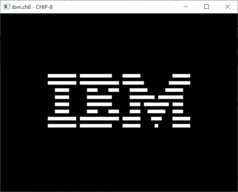
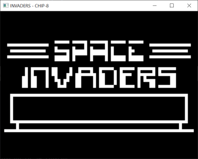

# chip8

A CHIP-8 emulator written in Rust

## Goal

The goal of this project is to build a fully functional emulator (but I should name it an interpreter) of the virtual CHIP-8 device. Moreover, it has (and still serves) as a great sandbox to learn and experiment about the [Rust](https://www.rust-lang.org/) language.

The source code is voluntarily and extensively commented for educational purposes.

## Help

```
USAGE:
    chip8.exe [OPTIONS] <ROM_PATH>

ARGS:
    <ROM_PATH>    Path to the ROM file

OPTIONS:
    -h, --help          Print help information
    -s, --super-chip    Run as the SUPER-CHIP
    -V, --version       Print version information
```

## State of the project

The program is "opcode complete" and runs correctly even though some improvements remain to be done (see [issues](https://github.com/fvilers/chip8/issues)).

## Screenshots






## Disclaimer

The source code found in this repository is original and I'm its sole author. But, a lot a comments are copied from or inspired by [Tobias V. Langhoff](https://github.com/tobiasvl)'s [guide to making a CHIP-8 emulator](https://tobiasvl.github.io/blog/write-a-chip-8-emulator/).

## Copyright

Copyright (c) 2022 Fabian Vilers
